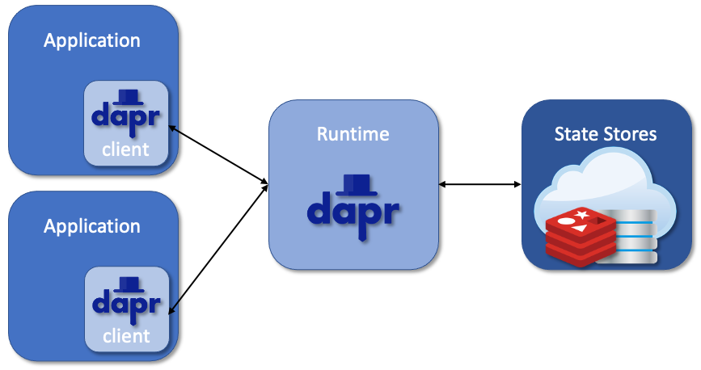
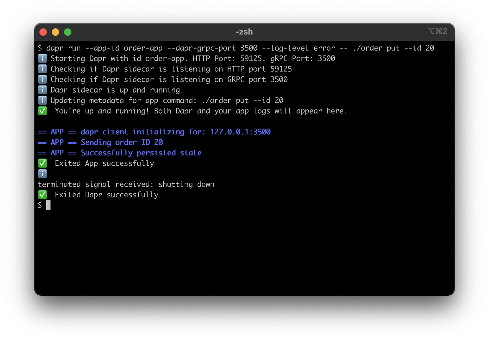
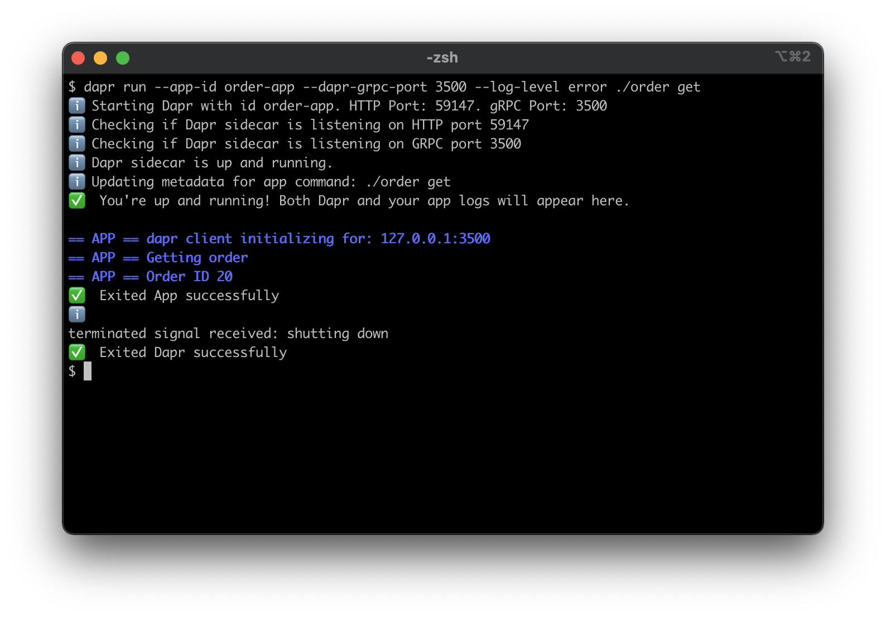
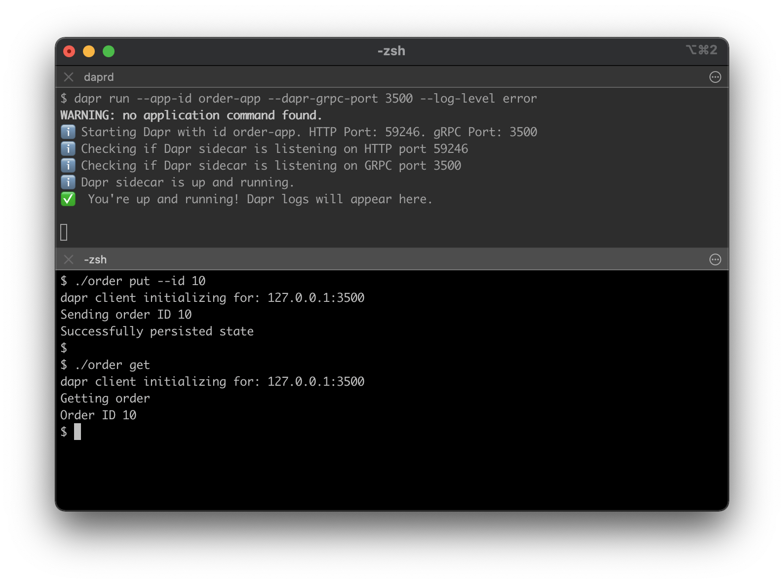
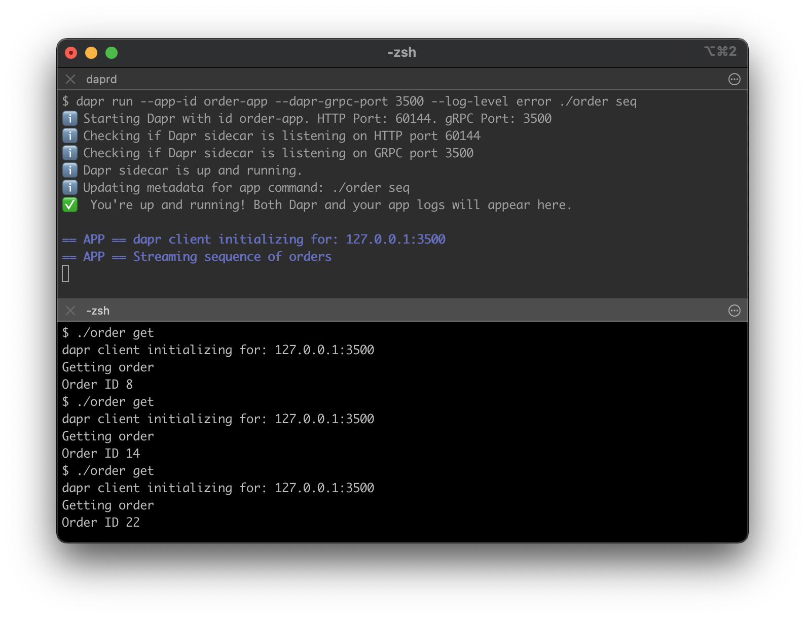

# Hello World

This tutorial will demonstrate how to instrument your application with Dapr, and run it locally on your machine.
You will deploying `order` applications with the flow identical to [Hello World](https://github.com/dapr/quickstarts/tree/master/tutorials/hello-world).

The application invokes Dapr API via Dapr client, which, in turn, calls Dapr runtime.

The following architecture diagram illustrates the components that make up this quickstart:


Dapr runtime supports multiple applications that could communicate with one another.
In a later example, you'll deploy two instances of the `order` app - one will update the state store, while another will read from it.

The architecture diagram below shows the addition of the new component:



## Prerequisites
This quickstart requires you to have the following installed on your machine:
- [Docker](https://docs.docker.com/)
- [Go](https://golang.org/)

## Step 1 - Setup Dapr

Follow [instructions](https://docs.dapr.io/getting-started/install-dapr/) to download and install the Dapr CLI and initialize Dapr.

## Step 2 - Understand the code

The [order.go](./order.go) is a simple command line application, that implements four commands:
* `put` sends an order with configurable order ID.
* `get` return the current order number.
* `del` deletes the order.
* `seq` streams a sequence of orders with incrementing order IDs.

First, the app instantiates Dapr client:

```go
    client, err := dapr.NewClientWithPort(port)
    if err != nil {
        panic(err)
    }
    defer client.Close()
```

Then, depending on the command line argument, the app invokes corresponding method:

Persist the state:
```go
    err := client.SaveState(ctx, stateStoreName, "order", []byte(strconv.Itoa(orderID)), nil)
```
Retrieve the state:
```go
    item, err := client.GetState(ctx, stateStoreName, "order", nil)
```
Delete the state:
```go
    err := client.DeleteState(ctx, stateStoreName, "order", nil)
```

## Step 3 - Run the app with Dapr

1. Build the app

<!-- STEP 
name: Build the app
-->

```bash
go mod vendor
go build -o order order.go
```

<!-- END_STEP -->

2. Run the app

There are two ways to launch Dapr applications. You can pass the app executable to the Dapr runtime:

<!-- STEP 
name: Run and send order
background: true
sleep: 5
expected_stdout_lines:
  - '== APP == dapr client initializing for: 127.0.0.1:3500'
  - '== APP == Sending order ID 20'
  - '== APP == Successfully persisted state'
-->

```bash
dapr run --app-id order-app --dapr-grpc-port 3500 --log-level error -- ./order put --id 20
```

<!-- END_STEP -->

<!-- STEP 
name: Run and get order
background: true
sleep: 5
expected_stdout_lines:
  - '== APP == dapr client initializing for: 127.0.0.1:3500'
  - '== APP == Getting order'
  - '== APP == Order ID 20'
-->

```bash
dapr run --app-id order-app --dapr-grpc-port 3500 --log-level error ./order get
```

<!-- END_STEP -->




Alternatively, you can start a standalone Dapr runtime, and call the app from another shell:

```bash
dapr run --app-id order-app --dapr-grpc-port 3500 --log-level error
```


```bash
./order put --id 10

./order get
```

To terminate your services, simply stop the "dapr run" process, or use the Dapr CLI "stop" command:

```bash
dapr stop --app-id order-app
```



3. Run multiple apps

You can run more than one app in Dapr runtime. In this example you will call `order seq` which sends a sequence of orders.
Another instance of the `order` app will read the state.

```sh
dapr run --app-id order-app --dapr-grpc-port 3500 --log-level error ./order seq
```

```sh
./order get

./order get
```


